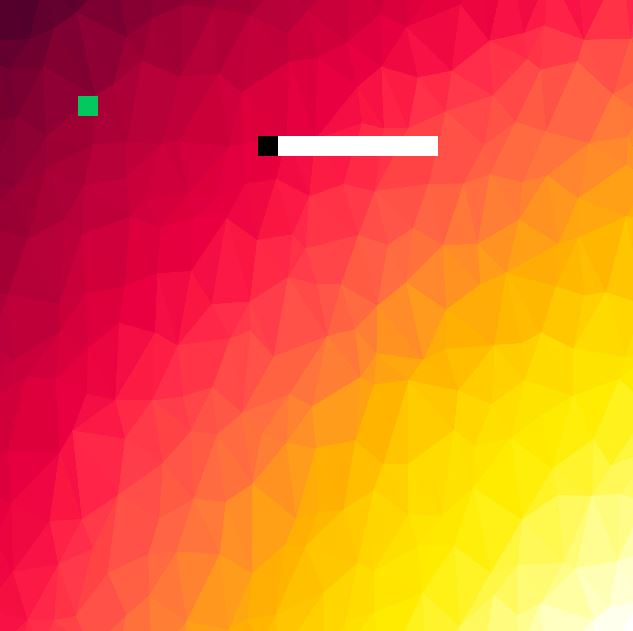

# CPPND: Capstone Snake Game (Proposed Project)

This is a starter repo for the Capstone project in the [Udacity C++ Nanodegree Program](https://www.udacity.com/course/c-plus-plus-nanodegree--nd213). The code for this repo was inspired by [this](https://codereview.stackexchange.com/questions/212296/snake-game-in-c-with-sdl) excellent StackOverflow post and set of responses.

## Step 1: Propose a Project

```
CppND-Capstone-Snake-Game
```

## Step 2: Scope the Project

```
* Already outlined project
* The project pass satisfy the "README" and "Compiling and Testing" 
* The project will pass at least five criteria for the rubric
```

## Step 3: Build your application

```
Done
```

## Step 4: Document Your Work

```
* The instructions for running 
* Basic Build Instructions
* Overview
* Explanation 
```

## Instructions for building - Dependencies for Running Locally

* cmake >= 3.7
  * All OSes: [click here for installation instructions](https://cmake.org/install/)
* make >= 4.1 (Linux, Mac), 3.81 (Windows)
  * Linux: make is installed by default on most Linux distros
  * Mac: [install Xcode command line tools to get make](https://developer.apple.com/xcode/features/)
  * Windows: [Click here for installation instructions](http://gnuwin32.sourceforge.net/packages/make.htm)
* SDL2 >= 2.0
  * All installation instructions can be found [here](https://wiki.libsdl.org/Installation)
  * Note that for Linux, an `apt` or `apt-get` installation is preferred to building from source.
* gcc/g++ >= 5.4
  * Linux: gcc / g++ is installed by default on most Linux distros
  * Mac: same deal as make - [install Xcode command line tools](https://developer.apple.com/xcode/features/)
  * Windows: recommend using [MinGW](http://www.mingw.org/)
* Addditionally: SDL2_Image >= 2.0
  * For Linux `sudo apt-get install libsdl2-image-dev`


## Basic Build Instructions

```
1. Clone this repo.
2. Make a build directory in the top level directory: `mkdir build && cd build`
3. Compile: `cmake .. && make`
4. Run it: `./Game_Capstone`.
```

## Overview and Support Added 

This project demonstrate a lot of C++ Programming language and extend this Snake game, following the principles I've learned throughout this Nanodegree Program. This project will demonstrate my independency to create applications using a wide range of C++ features.

The game now have new feature which is make the game more chalanging, by develope difficlty to the player, after eating food seven times the speed of the snake go up and the snake wont be able to go accross the wall, and the wall change color and become clear it can not be crossed, as well as the game ask the player if he/she want to play again, and finally create a log file.

Additionally the background of the game has been add by using SDL sub module for Images.

The original game screenshot:


Game after extended:



# Explanation

## (1) Understaing of C++ and OOP  
```
The project is organized into classes with class and spicifier attributes to hold the data and different techniques of Object Oriented Programming, and class methods to perform tasks, add to exesiting classes more clsses to extend the game to more functionalty and make it interactive. 
--> Demonstrated in class "Player" and class "Log" which was added
```

## (2) User inputs
```
The code accepts input from the user, and depending on it the execution flows to certian direction
--> Clear demonstrated in the file player.cpp in the loop
```

## (3) Read/Write data from/to files
```
The prject successfully write (dump) data from programm execution to a file as log file. 
--> Deonstreated in class "Log" which has been added.
```

## (4) Reference usage
```
The project code reference to define varuible, as well as passing parameter to function by reference
--> Demonstrated in the new "Player" class
```

## (5) Access Specifier 
```
All claass members are orgnized explicitly between public, protected and private, including the new added classes. 
--> Demonstrated in the new "Player" and "Log" classes
```

## (6) Classes abstract implementation details from their interfaces
```
All class member functions describe their functionality, either through function names or comments. 
--> Demonstrated all over the project and also in classes "Player" and "Log" 
```

## (7) Loops, Functions, I/O
```
A variety of control structures are used in the project.
```

## (8) Memory Management
```
At least two variables are defined as references, or two functions use pass-by-reference in the project code.
```

## Concurrency
```
Concurrency support planned to implement and show later, due the time limitation for the subscription. 
```
